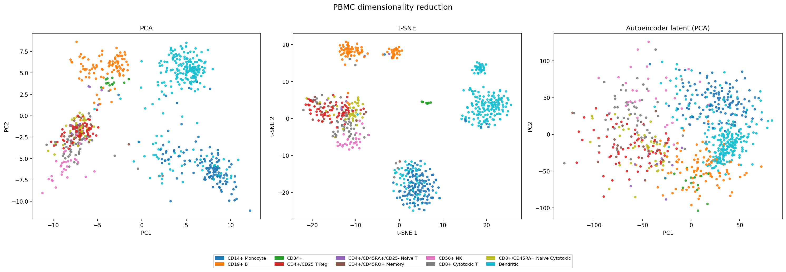
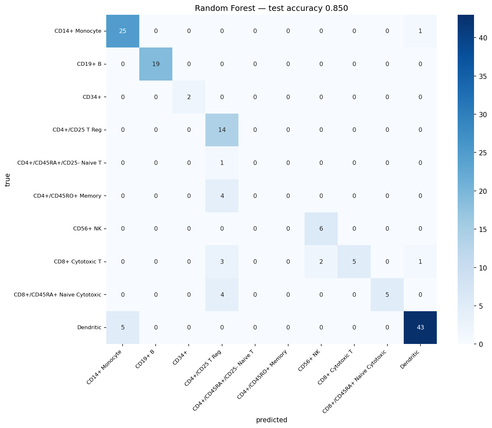
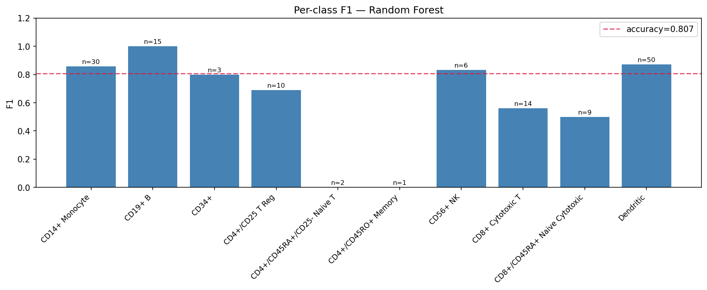
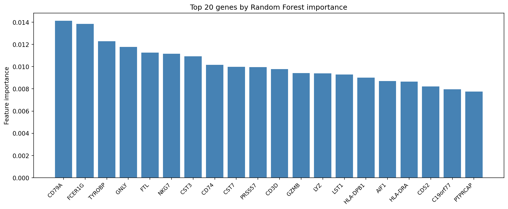

# PBMC Cell Type Classification via scRNA-seq


Dimensionality reduction and cell type classification on 700 human PBMCs from
single-cell RNA sequencing data, using autoencoders, PCA, t-SNE, and a Random Forest classifier.

---

## Overview

PBMCs (Peripheral Blood Mononuclear Cells) include the major cell types of the adaptive
immune system — T cells, B cells, NK cells, monocytes, and dendritic cells. scRNA-seq
measures gene expression in individual cells, enabling single-cell resolution analysis of
immune composition and state.

This project applies unsupervised and supervised machine learning to a 700-cell,
765-gene PBMC dataset to learn low-dimensional structure and classify cell types.

---

## Methods

### Part 1 — Dimensionality Reduction

| Method | Type | Key property |
|--------|------|--------------|
| PCA | Linear | Maximum variance directions |
| t-SNE | Nonlinear | Preserves local neighborhood structure |
| Autoencoder | Nonlinear (learned) | Reconstruction-optimized latent space |

Autoencoder architecture: `765 → 512 → 256 → 128 → 32 → 128 → 256 → 512 → 765`
Trained with MSE loss + L1 sparsity regularization, early stopping on validation loss.

### Part 2 — Classification

Random Forest (300 trees, balanced class weights) trained on raw expression features.
Evaluated with per class F1 score to account for class imbalance across 10 cell types.

---

## Results

**Dimensionality Reduction**

t-SNE separates the cell types most clearly. PCA and the autoencoder latent space show more overlap. PCA is a linear projection; the autoencoder optimizes for reconstruction rather than class separability.



**Classification**

Random Forest: **85.0% test accuracy** (5 fold CV: 81.6% ± 1.5%) on 10 PBMC cell types. Top features include known marker genes: CD79A (B cells), GNLY/NKG7 (NK/cytotoxic T), CD3D (T cells), LYZ/CST3 (monocytes).





---

## Cell Types

| Cell type | n |
|-----------|---|
| Dendritic | 240 |
| CD14+ Monocyte | 129 |
| CD19+ B | 95 |
| CD4+/CD25 T Reg | 68 |
| CD8+ Cytotoxic T | 54 |
| CD8+/CD45RA+ Naive Cytotoxic | 43 |
| CD56+ NK | 31 |
| CD4+/CD45RO+ Memory | 19 |
| CD34+ | 13 |
| CD4+/CD45RA+/CD25- Naive T | 8 |

---

## Usage

```bash
git clone https://github.com/amishaguptaberk/pbmc-celltype-classification
cd pbmc-celltype-classification
pip install -r requirements.txt
# place labels.csv and processed_counts.csv in data/
jupyter notebook notebooks/Part1_Autoencoder.ipynb
jupyter notebook notebooks/Part2_Classification.ipynb
```

---

## Background

BioE 145/245: Machine Learning for Computational Biology, UC Berkeley, Spring 2026.
Instructor: Professor Liana Lareau.

---

## License
MIT
